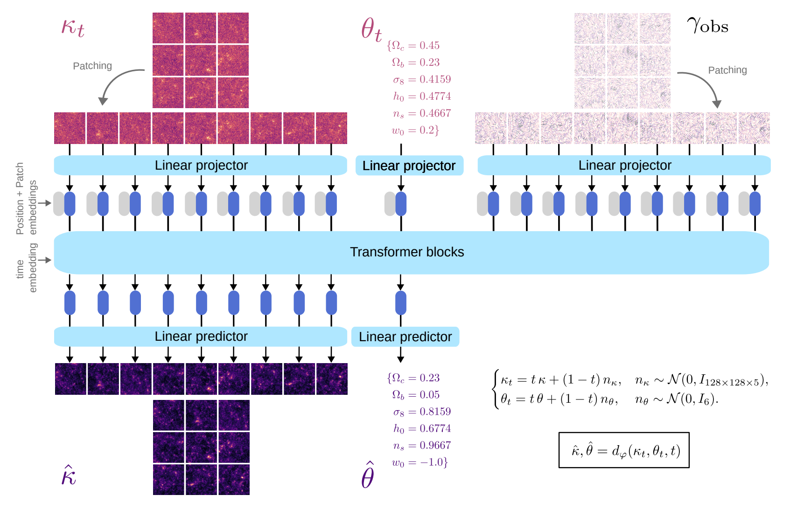
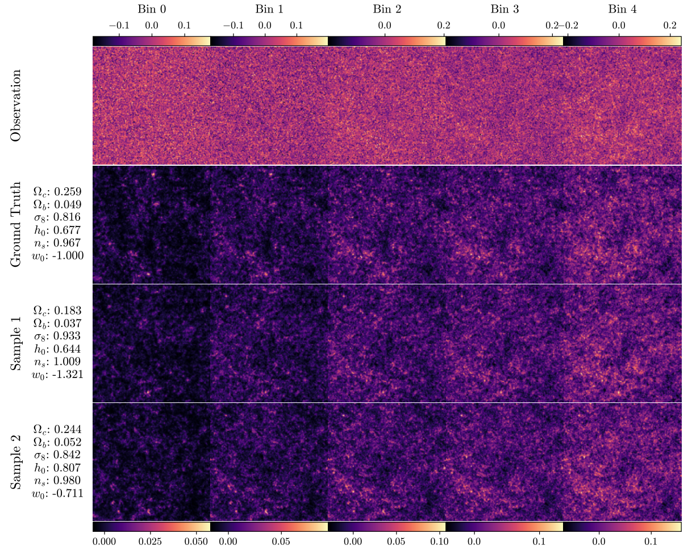
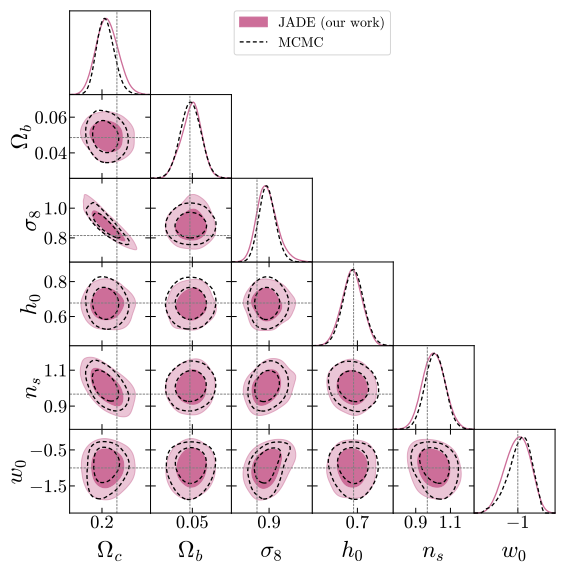

# Joint inference of weak lensing convergence map and cosmology with diffusion models

This repository contains the official implementation of the paper [Joint inference of weak lensing convergence map and cosmology with diffusion models](https://arxiv.org/abs/2606.31988) by [Benjamin Remy](https://github.com/b-remy), [Chihway Chang](https://chihway.github.io/) and [Rebecca Willett](https://willett.psd.uchicago.edu/).

<p align="center">
  
</p>

<p align="center">
  
  
</p>

**JADE** is a **J**oint **A**rchitecture for **D**ensity field and cosmology **E**stimates: a transformer denoiser operating in pixel space. The convergence field is split into patches and tokenised; the cosmological parameters are tokenised too; both sets of tokens go through the same transformer layers, so field and cosmology are denoised jointly. That gives a model of the joint distribution, and conditioning the sampler on an observed shear field gives posterior samples $(\theta, \kappa) \sim p(\theta, \kappa \mid \gamma_\mathrm{obs})$ without an explicit or differentiable likelihood.

## Code

The code is written in [Python](https://www.python.org). The denoiser is built and trained with [JAX](https://github.com/jax-ml/jax) and the [Flax NNX](https://flax.readthedocs.io/en/latest/nnx_basics.html) API, with [Optax](https://github.com/google-deepmind/optax) for optimization and [Weights & Biases](https://wandb.ai) for logging. The simulations used in the paper were generated with [sbi_lens](https://github.com/DifferentiableUniverseInitiative/sbi_lens) and [jax-cosmo](https://github.com/DifferentiableUniverseInitiative/jax_cosmo), and the reference MCMC chain with [NumPyro](https://github.com/pyro-ppl/numpyro). Summary statistics are computed with [LensTools](https://github.com/apetri/LensTools), contours with [GetDist](https://github.com/cmbant/getdist), and posterior calibration with [tarp](https://github.com/Ciela-Institute/tarp) and [mira-score](https://pypi.org/project/mira-score/).

Any Python package manager will do, though [uv](https://docs.astral.sh/uv/) is recommended. To install the library only:

```
uv pip install git+https://github.com/b-remy/jade.git
```

To also get the experiment scripts, clone the repository first:

```
git clone https://github.com/b-remy/jade.git
cd jade
uv pip install .
```

Use `uv pip install -e .` for an editable install, or `uv sync` to work from the locked dependency set.

The `tarp` and `mira-score` dependencies are forks, providing the `get_tarp_coverage_efficient` and `mira_bootstrap_efficient` entry points that the joint calibration metrics rely on and the released versions do not have. `pyproject.toml` currently resolves those, along with `jax-cosmo`, `sbi-lens` and `lenstools`, from checkouts sitting next to this repository.

## Reproducing the paper

[paper.md](paper.md) identifies the training run behind every published result, gives the commands for each stage in order, and records the caveats that matter for getting the same numbers back.

## TODO

- [ ] Publish the `tarp` and `mira-score` forks (for GPU acceleration).

## Citation

If you find this project useful for your research, please consider citing

```bib
@article{remy2026joint,
  title={Joint inference of weak lensing convergence map and cosmology with diffusion models},
  author={Remy, Benjamin and Chang, Chihway and Willett, Rebecca},
  journal={arXiv preprint arXiv:2606.31988},
  year={2026}
}
```
